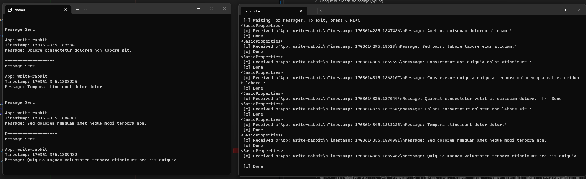
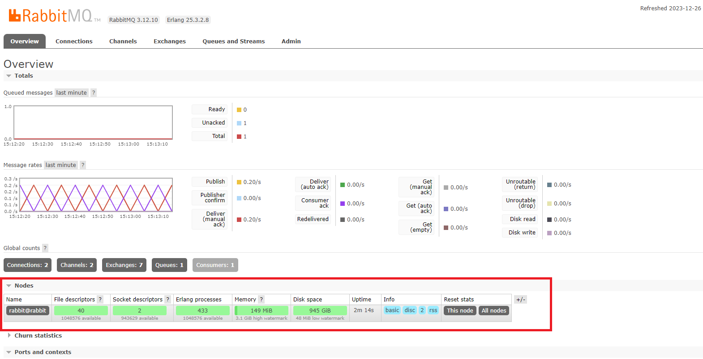
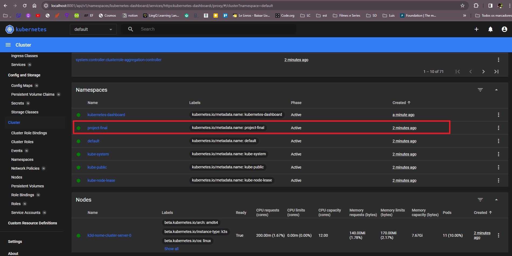
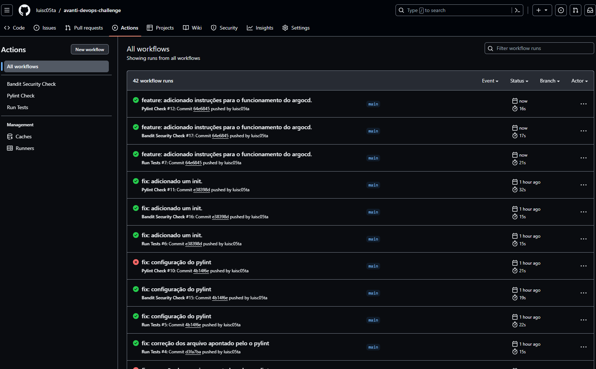
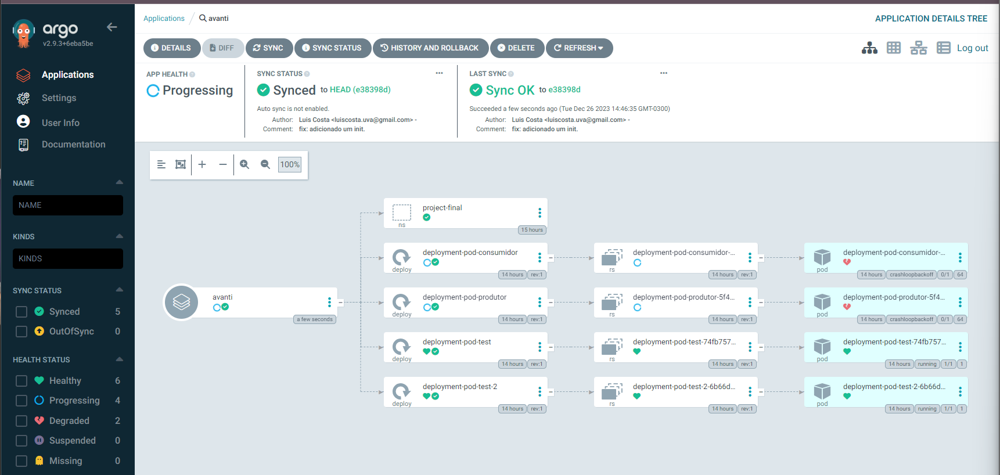

# Avanti DevOps Challenge

Este repositório contém o desafio de DevOps da Avanti. O desafio envolve a criação de um ambiente Docker, um cluster Kubernetes, manifestos Kubernetes, e configurações para CI/CD, além de monitoramento utilizando Prometheus, Grafana e AlertManager.


# Resumo das atividades
### 1. Docker e Requisitos

- ✅ **Dockerfile e Requisitos:** 
  - Crie o Dockerfile da aplicação.
  - Instale os requisitos necessários para que a aplicação funcione (verifique o arquivo requirements.txt).

### 2. Cluster Kubernetes

- ✅ **Crie um cluster Kubernetes com 2 nós:**  
- ✅ **Instale um dashboard** (Use ferramentas como Rancher, K8s Dashboard, etc.)

### 3. Manifestos Kubernetes

- ✅ **Crie os manifestos do Kubernetes:**
  - Preveja ambientes de Dev e Prod usando Kustomize.
  - ❌ **Deployment Agendado:** Execute a cada 1 minuto para gerar mensagens na fila.
  - ❌ **Parâmetros:**
    - ❌ **Nome:** ConfigMap
    - ❌ **Timer:** ConfigMap
    - ❌ **Mensagem:** Secret
    - ❌ **URL:** Secret

### 4. CI/CD - GitHub Actions / ArgoCD

- ✅ **Pipeline CI:**
  - Cheque segurança do código (bandit).
  - Cheque qualidade do código (pyLint).
  - Rode testes unitários (pyTest).
- ✅ **Pipeline CD:**
  - Gere a imagem da aplicação (Docker Hub - imagem pública).
  - Faça o deploy no Kubernetes.

### 5. Monitoramento (Prometheus / Grafana / AlertManager)

- ❌ **Monitoramento:**
  - ❌ **Saúde da aplicação.**
  - ❌ **Saúde do RabbitMQ.**


# Passos para Configuração 

## Como Iniciar


1. **Docker e Requisitos:**
    - É necessário a instalação do [Docker](https://docs.docker.com/desktop/install/windows-install/). <br>
    Neste projeto temos duas pastas onde encontramos os arquivos que foram usado para gerar as imagens
    para a criação do _project-final.yaml para rodar no kubernetes, os arquivos principais são:
        - write/write-rabbit.py
        - read/read-rabbit.py

    **Como testar a execução:**
    - abra um terminal e execute o rabbitmq 
        ```bash 
            docker run -d --hostname rabbit --name rabbit -p 8080:15672 -p 5672:5672 -e RABBITMQ_DEFAULT_USER=user -e RABBITMQ_DEFAULT_PASS=password rabbitmq:3-management    
        ```
    - no mesmo terminal entre na pasta "write" e execute o Dockerfile para gerar a imagem, e execute a imagem no modo iterativo para ver a execução do projeto
        ```bash 
            cd write/
            docker build -t write .
            docker run -it write
        ```
    - abra outro terminal entre na pasta "read" e execute o Dockerfile para gerar a imagem, e execute a imagem no modo iterativo para ver a execução do projeto
        ```bash 
            cd read/
            docker build -t read .
            docker run -it read
        ```

    - o arquivo write vai escreve algumas mensagens e vai ser passada pelo rabbitmq e o arquivo read vai escutar as mensagens
    - para ver mais informações pode acessar o localhost:8080 e entrar com o usuario: user e o senha:password para ver a aplicação se comunicando 
    
    o resultado seria mensagens no console 

    

    e no rabbitmq tem que aparecer dois socket conectados 

    

    

2. **Criar um cluster k8s com 2 nós**
    - É necessario ter o [K3d](https://k3d.io/v5.6.0/#releases) instalado
    - Utilize k3d e o comando `k3d cluster create nome-cluster`.

    - para esse exemplo temos que executar o arquivo `_project-final.yaml`
    ```bash
        kubectl create namespace project-final
        kubectl apply -f _project-final.yaml
    ```

   - Execute o comando para iniciar o dashboard: 
     ```bash
     kubectl apply -f https://raw.githubusercontent.com/kubernetes/dashboard/v2.7.0/aio/deploy/recommended.yaml
     ```
   - Execute o serviço `kubernetes-dashboard.yaml`.
    ```bash
        kubectl apply -f kubernetes-dashboard.yaml
    ```
   - Use o comando esse comando para iniciar o dashboard.
    ```bash
      kubectl proxy
    ```

   - Acesse o dashboard pelo endereço [http://localhost:8001/api/v1/namespaces/kubernetes-dashboard/services/https:kubernetes-dashboard:/proxy/#/login](http://localhost:8001/api/v1/namespaces/kubernetes-dashboard/services/https:kubernetes-dashboard:/proxy/#/login).

   - Será necessário um token, você pode executar em outro terminal o comando:
    ```bash
        kubectl -n kubernetes-dashboard create token admin-user
    ```

   - Cole o token.
   - Depois é só navegar pelo Kubernetes-dashboard e procurar o namespace `project-final` e os seus pods

   

3. **Kustomizer:**
   Para essa parte do projeto eu quebrei o arquivo `_project-final.yaml` na pasta kustomize,
   dentro da pasta kustomize eu criei dois ambiente para demostrar a aplicação do kustomize, nesse caso eu alterei apenas o namespace de `project-final` no Base para `project-final-dev` no Overlays/dev e `project-final-prod` no Overlays/prod
   
   - Comandos para gerar os YAML:
     ```bash
     kubectl apply -k base
     kubectl apply -k overlays/dev
     kubectl apply -k overlays/prod
     ```

4. **Pipelines:**
   Para demonstrar os pipelines eu criei uma pasta `.github/workflows/` para colocar os arquivos 
      - bandit.yml
      - pylint.yml
      - pytest.yml
   


**ArgoCD:**
   - Execute os comandos:
     ```bash
     kubectl create namespace argocd
     kubectl apply -n argocd -f https://raw.githubusercontent.com/argoproj/argo-cd/stable/manifests/install.yaml
     kubectl patch svc argocd-server -n argocd -p '{"spec": {"type": "LoadBalancer"}}'
     kubectl -n argocd get po,svc
     kubectl -n argocd port-forward service/argocd-server 8080:443
     ```
   - Acesse [http://localhost:8080](http://localhost:8080) com usuário "admin" e senha obtida pelo comando `argocd admin initial-password -n argocd`.


## Imagens Docker
- [Write Image](https://hub.docker.com/repository/docker/lu15c05ta/write/general)
- [Read Image](https://hub.docker.com/repository/docker/lu15c05ta/read/general)